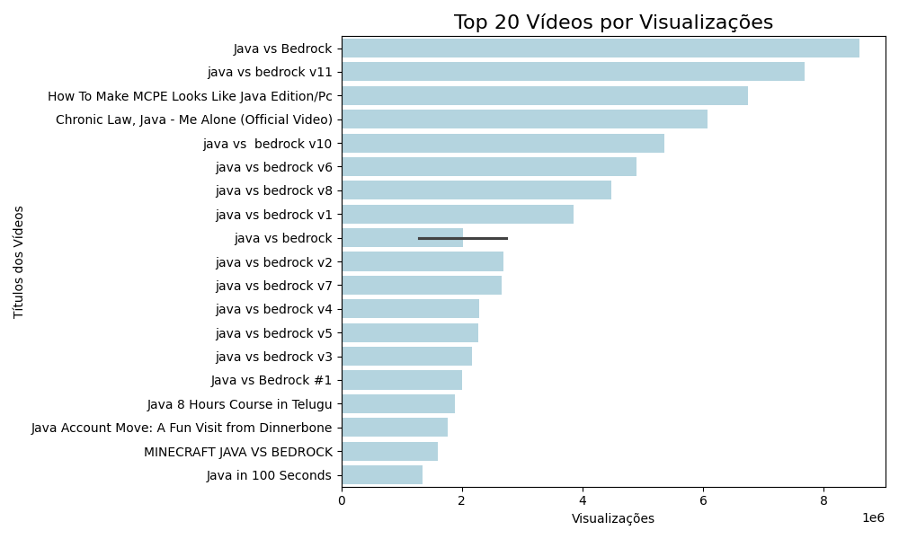

# Repositório de Coleta e Análise de Dados com Youtube API

Este repositório contém a análise de dados de vídeos do YouTube, realizada com auxílio da YouTube API e ferramentas de análise como Pandas, Seaborn, Matplotlib e WordCloud. A análise inclui coleta, processamento e visualização de dados com foco em vídeos relacionados a programação, dados e linguagens como Java e Python.

### Estrutura do Repositório

- `script.ipynb`: Contém o Jupyter Notebook com todo o processo de análise de dados.
- `crawler/`: Scripts responsáveis pela coleta dos dados via API do YouTube.
- `data/`: Diretório para armazenar os dados coletados (CSV).
- `img/`: Diretório para armazenar as imagens geradas durante a análise, como gráficos e nuvens de palavras.

### Bibliotecas Utilizadas
O projeto faz uso das seguintes bibliotecas no Jupyter Notebook:

```bash
Copiar código
import pandas as pd
import numpy as np
import matplotlib.pyplot as plt
import seaborn as sns
import csv
import re
from wordcloud import WordCloud, STOPWORDS
import matplotlib.pyplot as plt
```
### Como Executar o Jupyter Notebook

1. Clone este repositório:

```bash
git clone https://github.com/dotlincu/youtube-analysis.git
```

2. Navegue até o diretório do projeto:

```bash
cd youtube-analysis
```

3. Instale as dependências necessárias:

```bash
pip install -r requirements.txt
```

4. Execute o Jupyter Notebook:
```bash
jupyter notebook
```

5. Abra o arquivo `script.ipynb` no navegador e execute as células.

## Crawler para Coleta de Dados da YouTube API

Este projeto inclui um crawler simples para coletar dados de vídeos do YouTube utilizando a YouTube Data API v3.

### Dependências

- pandas
- google-api-python-client

Você pode instalá-las usando o seguinte comando:

```bash
pip install pandas google-api-python-client
```

### Inicialização

1. Defina as configurações da sua pesquisa no arquivo `crawler/config.py`

2. Rode o arquivo `reset.py` no diretório pai que contém o diretório crawler para criar os arquivos iniciais

```bash
python crawler/reset.py
```

3. Rode o arquivo `script.py` no diretório pai que contém o diretório crawler

```bash
python crawler/script.py
```

### Zerar a pesquisa

1. Definir as novas configurações no arquivo `config.py`

2. Rode o arquivo `reset.py` no diretório pai que contem o diretório crawler para criar os arquivos iniciais

```bash
python crawler/reset.py
```

3. Rode o arquivo `script.py` no diretório pai que contem o diretório crawler

```bash
python crawler/script.py
```

4. Os dados da pesquisa anterior serão mantidos no diretório `files - [data da finalização]`

## Resultados e Visualizações

Os dados coletados foram analisados e visualizados com o auxílio de gráficos e nuvens de palavras. Abaixo estão algumas visualizações geradas:

### Gráfico de Visualizações por Vídeo


### Nuvem de Palavras dos Comentários


### Repositório

Você pode acessar o relatório no seguinte link:

[Relatório de Coleta de Dados - Nuvem de Palavras](AMS___Nuvem_de_Palavras.pdf)